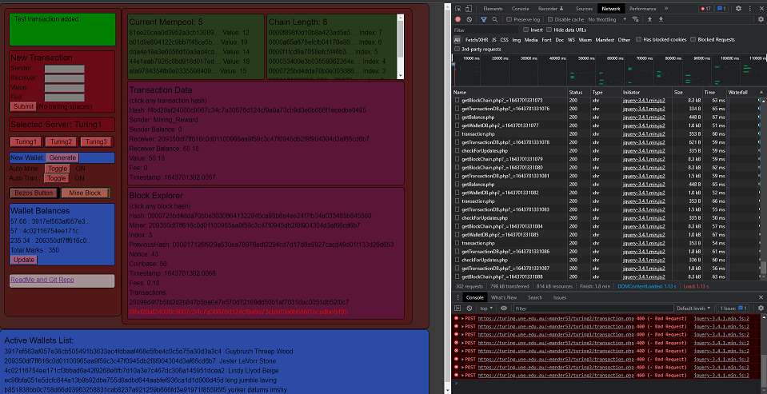
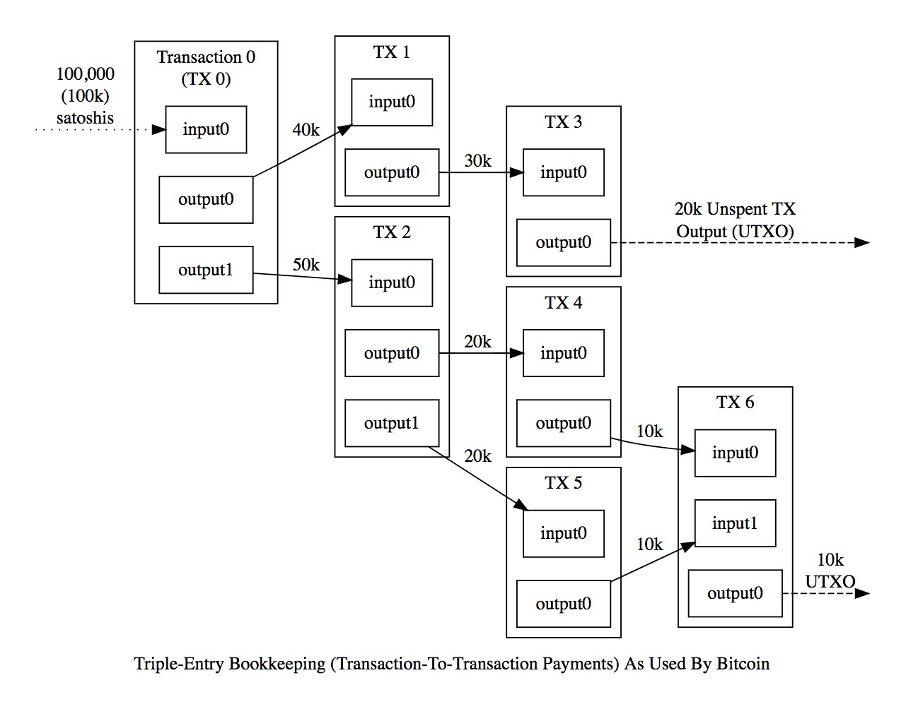

# Anderson Chain

## Introduction

The Anderson Chain and associated crypto currency tokens (hereafter referred to as "marks") is a blockchain and crypto currency project created by Mark Anderson for Cosc301 - University of New England.
A brief demonstration of the blockchain's core 'tamper-proof' functionality can be found at: <https://www.youtube.com/watch?v=XnggOjgr2_M>

### Server Hosting

The Anderson Chain is hosted on UNE's 'Turing' server accessible at:
<https://turing.une.edu.au/~mander53/AndersonChainClient/>  
Right now, it's all working as 3 entirely separate servers running on one machine, each server having its own 2 .json files storing everything (the blockchain and the mempool) .
Scaling up too many more servers would be a very simple task.  
The client is both a block explorer and wallet, so everything can be monitored and tested on one page. For ease of testing the automated mining can be turned on and off, and there is also an option to turn on/off automated random transaction generation.
The client is also hosted on turing but could be run from anywhere, it just sends _POST requests to the 3 servers on turing.

**A note on serverID:**  
There is a text file (no extension) in each server’s root directory with JUST the public key that mining rewards are allocated to. No quotation marks, or formatting of any kind, JUST the 64-digit wallet key.  
This is the only difference between servers and is used for several things, not just mining rewards.
It is essential.

**A note on Language Choice:**  
As I have very little experience with anything web/network I anticipated the 'make-it-distributed' portion of the project to be the most difficult (I was wrong). Which is why I chose to use js/php, allowing me to use my cosc260 final project as a launching point.  
Neither JS nor PHP are my strong suit, as is very evident by some of the code here. for eg: Only during the final days of this 3 month project did I realise I could make several different _POST requests to the same file. Which is why there are 12 .php files, it could/should be 1-3. I will likely do further refactoring of this project past its due date, for now in its current state it works, so I'm leaving it like this while its marked.

## Wallets and GUI

Each wallet consists of a 'private key' and a 'public key', the public key is simply a hash of the private key.  
Generating a new wallet key-pair doesn't 'add' it to the system in anyway, generating is just telling you, the user, how to control marks held by that public key. Marks must first be sent to that public key, and the transaction included in a block before the key exists on the chain at all.  
Unlike most crypto currencies my system uses SHA256 for both 'proof-of-work' and for wallet keys. (Others use Elliptic Curve Digital Signature Algorithm or ECDSA for keys). As I can use sha256 with JS and PHP without external libraries. I also chose to forgo the separation of public keys and wallet 'addresses' and just left them as the same thing.  

Private keys must be randomly generated and assigned; NOT chosen by the user.
During development I used a name+password system, but the possibility of duplicates dictated adoption of the common 'random word assignment' system.
The odds of creating a duplicate key in my system of 3-5 random words is less than 1 in 275000^3.  
The random word system is entirely a wallet/gui feature. If completely random characters were used to generate keys, there are 16^64 possible combinations.
Like most crypto currencies, knowing the private key grants full control of that wallet, loosing/forgetting the private key renders that wallet unrecoverable.  

My GUI is designed and made for the purpose of demonstrating and testing my block chain implementation. It is not really 'end-user' friendly at all, it is developer friendly. As is evident by the layout allowing space for browser dev-tools.



**It IS NOT 'robust' software.**  
It is a combination of wallet, block explorer, and diagnostic tools and is riddled with graphical bugs. It also allows the user to manually choose which server they are interacting with, which would never be possible (or good) in combination with a wallet app.  

For ease of testing my gui features a list of all active wallets public **and private** keys. This diagnostic feature is using the walletDB.json file on the server that really shouldn't be there. This file is not sync'd between servers so in testing if you want to use a particular wallet for a transaction you might need to switch servers.

Having gone though many many changes with tools coming in and out of the implementation constantly, the code has become somewhat spaghetti. I've tried to clean it up a bit, but it remains among the ugliest things I've ever done. The complexity of this project forced me to choose function over form.

While I have made an attempt to increase the efficiency of transaction processing compared to other prominent currencies, no such attempts were made with the GUI or diagnostic tools. The window displaying all current balances searches the **entirety** of the blockchain every time the button is clicked. It's inefficient on server memory, but bandwidth usage was kept in check.

Throughout development it was essential to keep a database on the server of all generated wallets. This was supposed to be removed at the end of development, but I have chosen to keep it as it is used for the automatic transaction generator.  
However, all other uses of it have been removed and disabling the database will only break the transaction creator.

## Transactions and the Mempool

Each server keeps a list of transactions waiting to be added to the block chain (referred to as the mempool).  
In the Anderson chain this is simply a .json file, a much more complex system accounting for distant servers, dynamic ping and server groups is used in bitcoin.  

Each transaction consists of:

| Key        | Type          | Example             |
| ---------- | ------------- | ------------------- |
| Hash       | String (Hash) | "3c11aca3aa27213de7f0b69cef858ac66c9e1c935e92654dd7e3317dcdd2cea9"   |
| Sender     | String (Hash) | "3917ef563af057e38cb505491b3633ac4fdbaaf468e5fbe4c0c5d75a30d3a3c4"   |
| Receiver   | String (Hash) | "4c02116754ee171cf3bbad6a42f9268e6fb7d10a3e7c467dc306a145951dcea2"   |
| Value      | Float         | 13                  |
| Fee        | Float         | 0.13                |
| Timestamp  | Float         | 1643204798.942423   |

(int and float types are converted to string when encoded to .json)

The Hash being generated from all other fields:

```PHP
$hash = hash('sha256', $sender.$receiver.$value.$fee.$timestamp);
```

Example of a transaction json object inside the mempool:

```JSON
{"Hash":"3c11aca3aa27213de7f0b69cef858ac66c9e1c935e92654dd7e3317dcdd2cea9",
"Sender":"3917ef563af057e38cb505491b3633ac4fdbaaf468e5fbe4c0c5d75a30d3a3c4",
"Receiver":"4c02116754ee171cf3bbad6a42f9268e6fb7d10a3e7c467dc306a145951dcea2",
"Value":"12",
"Fee":"0.12",
"Timestamp":"1643767764.1181"}
```

Additional fields are calculated and added during mining,  
( more on this in the 'Determiation of Balances, whats different about marks?' section of this write-up )  

| Key        | Type          | Example             |
| ---------- | ------------- | ------------------- |
| Sender Balance    | Float | 123.456       |
| Receiver Balance  | Float | 12.34540078   |

Example of a transaction json object inside the blockchain:

```JSON
{"Hash":"3c11aca3aa27213de7f0b69cef858ac66c9e1c935e92654dd7e3317dcdd2cea9",
"Sender":"3917ef563af057e38cb505491b3633ac4fdbaaf468e5fbe4c0c5d75a30d3a3c4",
"Sender Balance":"189.88",
"Receiver":"4c02116754ee171cf3bbad6a42f9268e6fb7d10a3e7c467dc306a145951dcea2",
"Receiver Balance":"123",
"Value":"12",
"Fee":"0.12",
"Timestamp":"1643767764.1181"}
```

Very little validation is preformed upon transaction creation and/or addition to a servers mempool. We check for sender = receiver and we check that there is record of the sender in the chain, but we do not check balances at transaction creation. There are several reasons for this, as a distributed system all things are asynchronous. It is entirely possible (and frequent in testing) for transactions in the mempool to be invalid for eg. a person with a balance of 3 marks trying to send someone 13 marks.  
Validation must be done in block mining to maintain chain integrity.  
**Additional** validation such as balance checking, or receiver ID verification would be handled client side by a user wallet app. My GUI did have such validation during development, but all balance functions were converted to server-side for mining.

The transaction timestamp is used briefly in sorting which transactions will go in each block.  
It is NOT used to retrieve a balance; it was originally designed to but that created one hell of bug that took days to find.  
The block timestamp plus the transactions index within that block is used for balance retrieval functions. (further explained in the 'Determiation of Balances, whats different about marks?' section.)

### Seperate Mempool per Server

I had started with the intention of synchronising mempools between servers, but late in the project after synchronising blockchains I better understood the scope and protentional bugs of such a task and decided to leave that feature out.  
Servers MUST have separate memory pools and MUST have the ability to 'recycle' rejected or invalid blocks. The complexity of recycling would use tremendous bandwidth and/or CPU time if servers could share some, (but not all) transactions.  
for eg. transaction validation currently does **not** involve searching the **entire** blockchain. If transactions **could** be in multiple mempools, we would need to check the entire chain for the existence of that transaction's Hash during mining (the entire chain, for every transaction).  

This is to be considered a 'missing' feature. In a truly 'distributed, immutable ledger' each server would be able to grab transactions from other nearby (low ping) servers.  
Transactions automatically generated by the gui just apply fees at 1% of the transaction value. However, when creating transactions you can set the fee to whatever you want, this is a key feature in other currencies as when servers 'grab' transactions from other server's mempools they cherry-pick those with the highest fees. A way to ensure your transaction gets into the chain quickly is to set your fee higher. The custom fee feature is in my gui but isn't relevant as there is no 'cherry-picking'.

## Blockchain, Mining, Proof of work


TODO:  
TODO:  
TODO:  
TODO:  


Each block consists of:

| Key           | Type          | Example           |
| ------------- | ------------- | ----------------- |
| Hash          | String (Hash) | "000068c6010900643187688419d0733ea84d782e0c46d57b0a2eaa8d8e211cbf" |
| Miner         | String (Hash) | "4c02116754ee171cf3bbad6a42f9268e6fb7d10a3e7c467dc306a145951dcea2" |
| Index         | Int           | 6                 |
| PreviousHash  | String (Hash) | "000025f524ee68eaeaedc8e46d0d8d105b442cecde899cb332c4f68a08d3c0d7" |
| Nonce         | Int           | 31774             |
| Coinbase      | Float         | 12.50             |
| Timestamp     | Float         | 1643204369.4139   |
| Fees          | Float         | 0.13              |
| TransactionData | Array [json objects] | [{"Hash":"3c11a...","Sender":"3917...},{"Hash":"7d0fe...","Sender":"2093...}] |
| TransactionHashes | Array [hash strings]  | ["3c11aca3aa27213de7...","7d0feb2a9acda926..."]   |

(int and float types are converted to string when encoded to .json)

The Hash being generated from fields:

```PHP
$hash = hash('sha256',$nonce.$miner.$index.$previousHash.$timestamp.$dataStr);
```

Example of a block json object in the chain:

```JSON
{"Hash":"000068c6010900643187688419d0733ea84d782e0c46d57b0a2eaa8d8e211cbf",
"Miner":"4c02116754ee171cf3bbad6a42f9268e6fb7d10a3e7c467dc306a145951dcea2",
"Index":"9",
"PreviousHash":"000025f524ee68eaeaedc8e46d0d8d105b442cecde899cb332c4f68a08d3c0d7",
"Nonce":"3658",
"Coinbase":"50",
"Timestamp":"1643767825.2422",
"Fees":"0.3",
"TransactionData":[  
    {"Hash":"3c11aca3aa27213de7f0b69cef858ac66c9e1c935e92654dd7e3317dcdd2cea9","Sender":"3917ef563af057e38cb505491b3633ac4fdbaaf468e5fbe4c0c5d75a30d3a3c4","Sender Balance":"189.88","Receiver":"4c02116754ee171cf3bbad6a42f9268e6fb7d10a3e7c467dc306a145951dcea2","Receiver Balance":"123","Value":"12","Fee":"0.12","Timestamp":"1643767764.1181"},  
    {"Hash":"7d0feb2a9acda9267ea314a3d61aead79636366e57980826f3a5059f4c021cf8","Sender":"209350df7ff616c0d01100965aa9f59c3c47f0945db2f8f904304d3af66cd6b7","Sender Balance":"31.82","Receiver":"4c02116754ee171cf3bbad6a42f9268e6fb7d10a3e7c467dc306a145951dcea2","Receiver Balance":"141","Value":"18","Fee":"0.18","Timestamp":"1643767788.1062"},  
    {"Hash":"4d8186251a220394b635cda66345fc50016511d10e97b4b45a0ecc9626252245","Sender":"Mining_Reward","Sender Balance":"0","Receiver":"4c02116754ee171cf3bbad6a42f9268e6fb7d10a3e7c467dc306a145951dcea2","Receiver Balance":"191.3","Value":"50.3","Fee":"0","Timestamp":"1643767825.2425"}
    ],
"TransactionHashes":["3c11aca3aa27213de7f0b69cef858ac66c9e1c935e92654dd7e3317dcdd2cea9","7d0feb2a9acda9267ea314a3d61aead79636366e57980826f3a5059f4c021cf8","4d8186251a220394b635cda66345fc50016511d10e97b4b45a0ecc9626252245"]}
```

### Determination of Balances, whats different about 'marks'?

To move value between wallets Bitcoin uses a ‘change’ system referred to as UTXOs ( Unspent Transaction Outputs ). Each transaction has sender UTXO’s assigned to it until the collective value of them is greater than the transaction value. Any remaining funds are now considered a UTXO for future use. 

< Image lifted from: <a href="https://medium.com/dcresearch/tracking-bitcoin-market-cycles-with-utxo-7ab554daed66"> medium.com </a> >

The Anderson Chain forgoes this system entirely and instead records the balance of both wallets involved within in each transaction.  
My balance system is designed to be far more efficient and simpler than the utxo system at the cost of privacy.  
The code however is not simpler at all, the complexity of finding the most recent validated balance grew as more advanced blockchain features were introduced. Transactions added to the mempool when they are **invalid** that **later become valid** and ‘tampered with’ blocks being identified and recycled both necessitated re-designs and re-writes of the balance retrieval code. It remains accurate and more efficient in the event of very long chains but is far from simple.

Each time a transaction is being added to a block before it is mined, the balanceFromArrayThenChain() function is called.

``` php
function balanceFromArrayThenChain($key, $array) {

  if (!empty($array)){
    foreach(array_reverse($array) as $a => $b) {
      if ($key === $b['Sender']){
        return floatval($b['Sender Balance']);
      }
      else if ($key === $b['Receiver']){
        return floatval($b['Receiver Balance']);
      }
    }
  }
    // if we get though the current selected list, and haven't got a
    // balance yet, dig into the blockchain for it
  return floatval(getBalance($key));
}
```

This function is required to allow a wallet to appear in a single block more than once. (If we JUST did a transaction with this wallet, use that balance - don't go digging again)  
Only when this array finds nothing ( first transaction of the current block featuring this wallet ) does it go the block chain for a balance.

The getBalance() function (lines 93-133 of getBalance.php) retrieves the balance from the blockchain. It is more complicated as it needs to select from a list of transactions, choosing the most recently validated currently on the chain. We need to generate a list from several blocks to account for fringe cases of transaction being validated out of order, or validated twice, or the very rare occurrence that servers have different chains for just 1 mining cycle (resulting in recycling)  

## Theory and Project references

Alongside developing the Anderson Chain, over the past 4 months I also completed two Udemy courses and the 'Naivecoin' Tutorial  
<https://lhartikk.github.io/jekyll/update/2017/07/15/chapter0.html>  
It was good to go through the Naivecoin tutorial and the first Udemy course together, to have a technical coding example done alongside the theory.

<https://www.udemy.com/course/blockchain-and-bitcoin-fundamentals/>  
This Udemy course looked very elementary on the surface, but there was some stuff touched on I didn’t know about, so it was worth going through.
I would recommend this one to all but experts in the area. Despite not being technical with no code at all, as a holistic explanation this short course fills in any small gaps in theory knowledge.

<https://www.udemy.com/course/build-your-blockchain-az/>  
While this Udemy course is significantly longer, its covering pretty much the same depth. The extra time is due mostly to it being accompanied by a practical example in Python.
I’m glad I looked at this course as I find python and the flask web framework a lot easier to deal with then the Typescript that Naivecoin uses.

On top of the python example from the second Udemy course I’ve also been using Naivecoin and its predecessor ‘NaiveChain’ as reference while coding my blockchain, and also just to clarify some of the more complex concepts I come across.

I also made use of <https://www.blockchain.com/explorer> during both theory and development.

## Final Thoughts  

After completing this unit and digging into the 'nuts and bolts' of these systems my views on the future of crypto currency have changed. I no longer see the great potential in these systems, I now see only environmental damage.

* A cryptocurrency  being government controlled removes the need for the 'hashing race' but also removes most of the fundamental advantages of the idea. Giving even greater control over which transactions get processed and when they get processed to those proven most dishonest.  
I feel that a government controlled cryptocurrency **replacing** cash would be a catastrophe both economically and for civil rights. (A cryptocurrency working alongside current systems has merit)

* A p2p distributed system such as bitcoin or any other major crypto currency **requires** the 'hashing race'. I see no way of avoiding this key part of these systems.  
Incentive is required to maintain the ledger and competition will always spring from that. As this system is more widely adopted and each block's transaction fees rise it will become increasingly profitable to waste as power at scale. This cannot be sustained.
